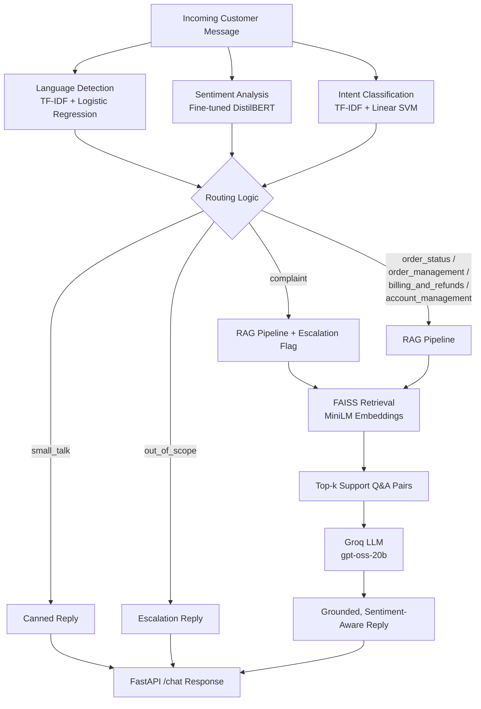

# 🛒 RAG-Powered E-Commerce Support Chatbot


An end-to-end, multi-model customer support chatbot for e-commerce, combining **classical ML**, **fine-tuned Transformers**, and **Retrieval-Augmented Generation (RAG)** — built and deployable within a 1-day engineering timeline, fully runnable on **Google Colab** (free tier).

The system detects the customer's **language**, **sentiment**, and **intent**, then routes the message to a **FAISS + LLM (Groq) RAG pipeline** to generate a grounded, context-aware reply — with automatic escalation to a human agent when needed.

---

## 📋 Table of Contents

- [Key Benefits](#-key-benefits)
- [Architecture](#-architecture)
- [Project Structure](#-project-structure)
- [Pipeline Workflow](#-pipeline-workflow)
- [Models, Datasets & Design Rationale](#-models-datasets--design-rationale)
- [Accuracy & Evaluation](#-accuracy--evaluation)
- [Tech Stack](#-tech-stack)
- [Getting Started](#-getting-started)
- [API Reference](#-api-reference)
- [Example Interaction](#-example-interaction)
- [Limitations & Future Work](#-limitations--future-work)

---

## ✨ Key Benefits

| Benefit | Description |
|---|---|
| **Zero-cost stack** | Every component (models, vector store, LLM inference) runs on free tiers — Colab, FAISS (local), Groq free API. |
| **Fast to train, fast to run** | Classical ML modules (language & intent) train in seconds; the sentiment model fine-tunes in minutes; no GPU cluster required. |
| **Multi-signal routing** | Combines language, sentiment, and intent detection so replies are contextually and emotionally aware, not just topically correct. |
| **Grounded answers, not hallucinations** | RAG retrieves real historical support Q&A pairs before generation, and the LLM is instructed to say "I don't know" rather than guess. |
| **Automatic escalation** | Complaints and out-of-scope requests are automatically flagged and routed to a human agent. |
| **Modular & swappable** | Each stage (language, sentiment, intent, retrieval, generation) is an independent, swappable component (e.g., FAISS → Qdrant is a ~10-line change). |
| **One-click deployment** | Ships as a FastAPI service tunneled through ngrok directly from a Colab notebook — no separate infrastructure needed for a demo. |
| **Multilingual aware** | Detects the customer's language up front, enabling future localization of replies. |

---

## 🏗 Architecture



**Design principle:** classification stages are cheap and fast (run on every message), while the expensive RAG + LLM call is only invoked when the message actually needs a grounded, generative answer.

---

## 📁 Project Structure

```
chatbot_project/
│
├── 01_language_detection.ipynb    # TF-IDF + Logistic Regression language ID model
├── 02_sentiment_classifier.ipynb  # Fine-tuned DistilBERT emotion/sentiment model
├── 03_intent_classifier.ipynb     # TF-IDF + Linear SVM intent routing model
├── 04_rag_pipeline.ipynb          # FAISS index + Groq LLM RAG pipeline
├── 05_deploy_on_colab.ipynb       # FastAPI service + ngrok tunnel, wiring all 4 models
│
└── models/                        # (generated at runtime, saved to Google Drive)
    ├── language_detector.joblib
    ├── sentiment_model/
    ├── intent_classifier.joblib
    ├── rag_index.faiss
    └── rag_corpus.parquet
```

Each notebook is self-contained, mounts Google Drive, and saves its trained artifact to a shared `models/` directory so the final deployment notebook can load everything without retraining.

---

## 🔄 Pipeline Workflow

1. **Mount Drive & install dependencies** — every notebook mounts `/content/drive/MyDrive/chatbot_project` as a shared model store.
2. **Language Detection** — cleans text lightly (whitespace only — case/diacritics are preserved as signal), then trains a TF-IDF (character n-grams, 2–5) + Logistic Regression classifier.
3. **Sentiment Classification** — fine-tunes DistilBERT on `dair-ai/emotion`, remapping 6 fine-grained emotions down to 3 coarse routing buckets (**negative / neutral / positive**), then sanity-checks on hand-written support-style messages to catch domain shift (Twitter → customer support).
4. **Intent Classification** — condenses 27 fine-grained Bitext intents into 7 business-relevant routing groups (`order_status`, `order_management`, `billing_and_refunds`, `account_management`, `complaint`, `out_of_scope`, plus implicit `small_talk` handling), trained with TF-IDF + Linear SVM.
5. **RAG Pipeline** — embeds all historical support questions with `all-MiniLM-L6-v2`, indexes them in a local FAISS `IndexFlatIP` (cosine similarity via normalized inner product), retrieves the top-k most similar past Q&A pairs for any new query, and feeds them as grounding context to a Groq-hosted LLM (`gpt-oss-20b`) for answer generation.
6. **Deployment** — all four trained artifacts are loaded into a single FastAPI app exposing a `/chat` endpoint; the app classifies language/sentiment/intent, routes to either a canned reply, an escalation message, or the RAG pipeline, and returns a structured JSON response. The service is exposed publicly via `pyngrok` directly from Colab for live testing.

---

## 🧠 Models, Datasets & Design Rationale

| Stage | Model | Dataset | Why this choice |
|---|---|---|---|
| **Language Detection** | TF-IDF (char n-grams) + Logistic Regression | `papluca/language-identification` | Language ID is a lexical/character-pattern problem — classical ML with char n-grams solves it accurately and trains in seconds, freeing up time for harder modules. |
| **Sentiment Analysis** | Fine-tuned `distilbert-base-uncased` | `dair-ai/emotion` (6 classes → 3 buckets) | A fine-tuned Transformer converges in very few epochs even on modest data — important under a tight deadline. Coarse 3-bucket mapping (negative/neutral/positive) transfers better across the Twitter→support domain shift than the original 6 fine-grained emotions. |
| **Intent Classification** | TF-IDF + Linear SVM (`LinearSVC`) | `bitext/Bitext-customer-support-llm-chatbot-training-dataset` | Gold intent labels already exist, so this is plain supervised text classification. On ~27k short instruction-style texts, a linear SVM matches/beats a from-scratch deep model, trains in seconds, and is easy to explain. |
| **Retrieval** | `sentence-transformers/all-MiniLM-L6-v2` embeddings + FAISS `IndexFlatIP` | Bitext `instruction`/`response` pairs (deduplicated) | Fully local and free — avoids external vector-DB account setup/latency. Swapping to a managed store like Qdrant later is a small, isolated change. |
| **Generation** | Groq API — `openai/gpt-oss-20b` | Retrieved context only (RAG) | Free tier, very fast inference — well suited for live demos. The prompt instructs the model to answer only from retrieved context, acknowledge frustration, and escalate rather than hallucinate when context is insufficient. |

### Intent Routing Groups
`27 fine-grained Bitext intents` are condensed into:
`order_status` · `order_management` · `billing_and_refunds` · `account_management` · `complaint` · `out_of_scope` (+ small-talk handling in the API layer)

### Sentiment Mapping
`sadness / anger / fear → negative` · `surprise → neutral` · `joy / love → positive`

---

## 📊 Accuracy & Evaluation

> Exact numbers depend on the specific training run (random seeds, dataset version), but each notebook reports these metrics on hold-out data:

| Model | Metric | Reported In |
|---|---|---|
| Language Detector | Validation & test **accuracy** + full `classification_report` (per-language precision/recall/F1) | `01_language_detection.ipynb` |
| Sentiment Classifier | **Accuracy** and **macro F1** on the test split, computed each epoch via `evaluate` | `02_sentiment_classifier.ipynb` |
| Intent Classifier | Full `classification_report` (precision/recall/F1 per intent group) on a stratified 15% hold-out | `03_intent_classifier.ipynb` |
| RAG Retrieval | Qualitative relevance check via cosine-similarity scores on sample queries | `04_rag_pipeline.ipynb` |

**Qualitative validation:** the sentiment model is additionally spot-checked against hand-written customer-support-style messages (not just Twitter-style test data) to confirm it generalizes past the training domain before being trusted in production routing.

---

## 🛠 Tech Stack

**Classical ML:** scikit-learn (`TfidfVectorizer`, `LogisticRegression`, `LinearSVC`), `joblib`

**Deep Learning:** 🤗 Transformers, `datasets`, `evaluate`, `accelerate`, PyTorch (via `Trainer` API)

**Retrieval / RAG:** `sentence-transformers` (MiniLM), FAISS (`faiss-cpu`), Groq LLM API

**Serving:** FastAPI, Uvicorn, Pydantic, `pyngrok` (public tunnel), `nest_asyncio` (Colab event-loop compatibility)

**Infra:** Google Colab (free tier), Google Drive (persistent model storage)

---

## 🚀 Getting Started

1. **Open each notebook in Colab** (badges are embedded at the top of every notebook) in order: `01 → 02 → 03 → 04 → 05`.
2. Each notebook mounts Google Drive and saves its model to:
   `/content/drive/MyDrive/chatbot_project/models/`
3. Set your API keys where indicated:
   - `GROQ_API_KEY` — free key from [groq.com](https://groq.com)
   - `NGROK_AUTHTOKEN` — free token from [ngrok.com](https://ngrok.com) (deployment notebook only)
4. Run `05_deploy_on_colab.ipynb` last — it loads all four trained models and starts a public FastAPI endpoint.
5. Test with the returned ngrok URL:

```bash
curl -X POST <PUBLIC_URL>/chat \
  -H "Content-Type: application/json" \
  -d '{"message": "Where is my order #4521?"}'
```

> ⚠️ **Security note:** Never commit real API keys to version control. The keys shown in the notebooks are placeholders — replace them with environment variables or Colab secrets before sharing/publishing.

---

## 📡 API Reference

### `POST /chat`

**Request body:**
```json
{
  "message": "string"
}
```

**Response body:**
```json
{
  "language": "string",
  "sentiment": "negative | neutral | positive",
  "intent": "order_status | order_management | billing_and_refunds | account_management | complaint | out_of_scope | small_talk",
  "reply": "string",
  "escalate": true,
  "sources": [
    { "instruction": "string", "response": "string", "score": 0.87 }
  ]
}
```

- `escalate` is `true` for `complaint` and `out_of_scope` intents, signaling a hand-off to a human agent.
- `sources` is populated whenever the RAG pipeline was used, providing traceability for the generated answer.

---

## 💬 Example Interaction

**Input**
```json
{ "message": "I never received my refund for order 88213, this is ridiculous!" }
```

**Pipeline behavior**
- Language → `en`
- Sentiment → `negative`
- Intent → `complaint`
- Routing → RAG pipeline + escalation

**Output (illustrative)**
```json
{
  "language": "en",
  "sentiment": "negative",
  "intent": "complaint",
  "reply": "I'm really sorry to hear about this experience — that's not the standard we want for you. Based on our records, refunds are typically processed within 5-7 business days... I'm also flagging this to a human agent so we can follow up personally.",
  "escalate": true,
  "sources": [
    { "instruction": "I have not received my refund yet", "response": "...", "score": 0.91 }
  ]
}
```

---

## ⚠️ Limitations & Future Work

- **Domain shift risk:** the sentiment model is trained on Twitter data; while mitigated with coarse bucketing and qualitative checks, a support-domain-labeled dataset would improve reliability further.
- **Single-turn design:** the current API is stateless per message — no conversation memory across turns.
- **No re-ranking:** retrieval uses pure cosine similarity (top-k); adding a cross-encoder re-ranker could improve answer grounding for ambiguous queries.
- **Local vector store:** FAISS is in-memory and rebuilt on each session; a managed vector DB (e.g., Qdrant, Pinecone) would be needed for production-scale persistence and concurrent access.
- **Colab-based deployment:** suitable for demos/assessment; a production deployment would move to a persistent server (Docker + cloud host) rather than an ngrok tunnel.
- **Language detection ≠ localization:** the pipeline currently detects language but always replies in English via the LLM; a natural extension is generating replies in the customer's detected language.

---

*Built as a rapid, cost-free, end-to-end NLP + RAG customer support system — optimized for demonstrating sound ML design trade-offs under a tight timeline.*
